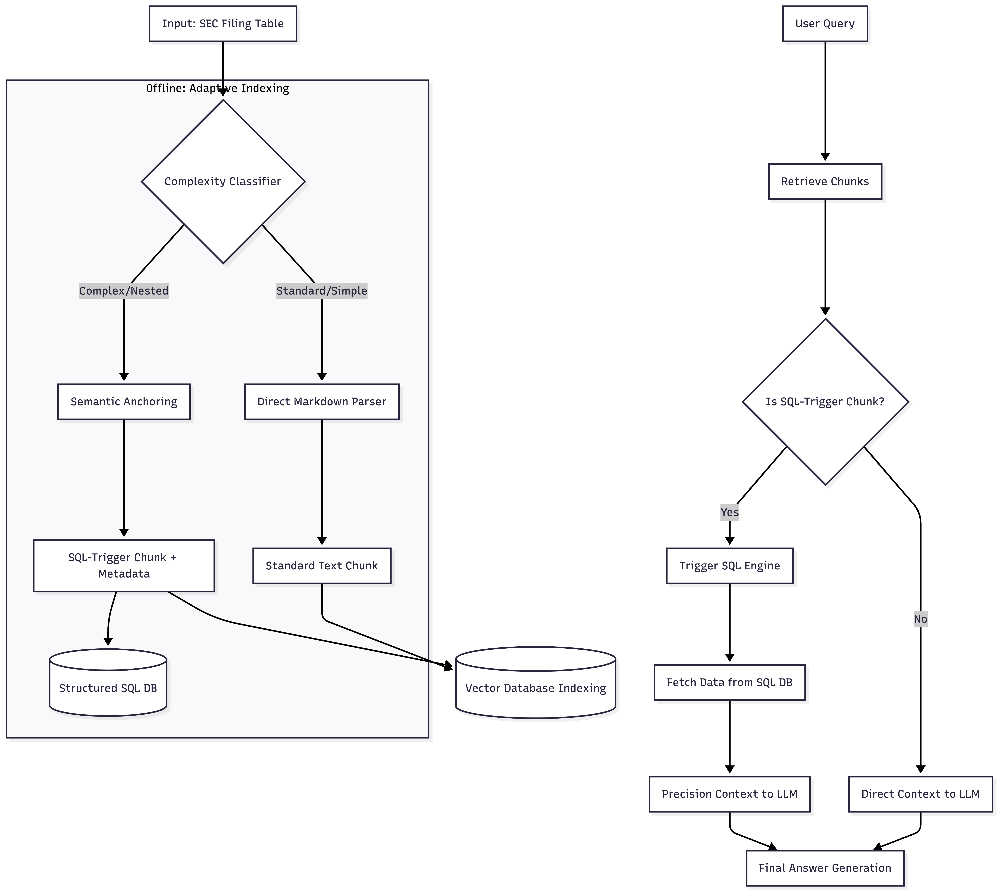

# TechFilings: Professional Financial Intelligence Assistant
**Bridge the gap between complex SEC filings in iXBRL format and actionable financial insights using a high-precision, Agentic RAG architecture.**

## 🎯 What can you do with TechFilings?
Stop scrolling and start analyzing. TechFilings streamlines the most labor-intensive parts of financial research:

**🔍 Precision Financial Q&A**

Query: "What were the primary drivers of the 15% increase in SG&A expenses this quarter?"

Capability: Instantly retrieves the answer from the Management’s Discussion and Analysis (MD&A) section. TechFilings doesn't just give a summary; it also provides the **exact source text (original chunks)** used for the answer, along with the **document name** and **deep-links** for immediate verification.

**📊 Complex Tabular Extraction**

Query: "Extract the Consolidated Statement of Cash Flows for the last three fiscal years."

Capability: Unlike standard AI, TechFilings handles nested and multi-layered tables. It reconstructs messy iXBRL grids into structured formats ready for Excel or SQL analysis.

**⚠️ Risk & Sentiment Auditing**

Query: "How has the tone regarding 'Supply Chain Constraints' changed compared to last year's filing?"

Capability: Uses a Reasoning Agent to perform semantic delta-analysis, identifying subtle shifts in management’s risk disclosures that keyword searches would miss.

**🔗 Multi-Step Financial Reasoning**

Query: "Does the inventory buildup mentioned in the footnotes align with the reported decrease in operating cash flow?"

Capability: Executes multi-hop reasoning across different document sections (e.g., matching Balance Sheet data with Footnote disclosures) to verify financial narratives.

# 🛡️ Why TechFilings? (The Technical Superiority)
While standard RAG systems struggle with the "last mile" of financial data accuracy, TechFilings gains its competitive advantage through **three strategic pillars**:

**1. Domain-Specific Embeddings (The "Financial Brain")**

❌ Generic embedding models often fail to capture the nuance of financial terminology (e.g., confusing "provision" in a legal context vs. a financial one).

✅ TechFilings uses Fine-tuned Embedding Models trained specifically on financial corpora. This ensures that the retrieval stage understands deep semantic relationships.

**2. Structural Integrity via Markdown Reconstruction**

❌ Standard PDF-to-text converters destroy the visual hierarchy of financial reports.

✅ TechFilings reconstructs filings into Markdown format. This preserves headers, lists, and relationship cues, allowing the LLM to "see" the document's structure just as a human analyst would, significantly reducing hallucinations during generation.

**3. Hybrid Tabular Intelligence (Adaptive Pipeline)**

<div align="center">
  
  <br>
  <p align="center">
    <em>Figure: The Adaptive Tabular Intelligence Pipeline (Stage-based routing)</em>
  </p>
</div>

❌ Tables are the heart of SEC filings, yet they remain the "blind spot" for standard AI. 

✅ TechFilings overcomes this with a **proprietary dual-path routing system** that intelligently selects the optimal extraction strategy based on structural complexity:

Strategic Routing Paths:
The High-Efficiency Path (Standard Tables):
For straightforward grids, the system utilizes **optimized heuristic parsing**. This ensures lightning-fast processing and **zero API overhead** for routine data extraction where structural mapping is redundant.

The High-Precision Path (Complex/Nested Structures):
For dense, multi-layered financial statements (e.g., Cash Flow or Footnote tables), TechFilings triggers a **Two-Stage Semantic Workflow**:

**Stage 1** - Semantic Anchoring: Instead of indexing raw numerical noise, the system reconstructs the **table's structural hierarchy, headers, and metadata** into **specialized Markdown Anchors**. This allows the retriever to "understand" the table's context and relevance during the search phase without getting lost in cell-level data.

**Stage 2** - Contextual SQL Mapping: Once a specific table is identified via a semantic match, the system activates a **dynamic mapping engine**. It translates the user’s natural language intent into a targeted Table-to-SQL extraction, precisely isolating metrics (e.g., "Total Assets") and ensuring they are 100% aligned with their corresponding fiscal years or reporting segments.

**The Result**: TechFilings delivers the speed of heuristic parsing combined with the uncompromising data integrity of a structured database.

## 🚀 Key Features
- **iXBRL-aware parsing** — distinguishes financial data from layout artifacts in SEC filings
- **Complexity-based table routing** — BeautifulSoup for simple tables, LLM fallback for complex nested structures
- **Section-aware chunking** — every chunk carries its filing section for precise citation
- **Source-grounded answers** — every response cites the exact filing, form type, and section
- **Collapsible citations** — expandable source passages in the chat UI
- **User feedback collection** — stored in Supabase after every 3 questions

---

## 🛠 Tech Stack

| Architectural Layer | Component / Technology
|---|---|
| Reasoning Engine | Multi-Agent Orchestration (GPT-4o-mini / Specialized Financial Agents)
| Dual-Path Retriever | Hybrid Search (ChromaDB Dense + BM25 Sparse) w/ RRF Fusion
| Retrieval Precision | Fine-tuned Domain-Specific Embeddings + Cross-Encoder Reranking
| Structured Intelligence | Heuristic Parser (BS4) + Proprietary Table-to-SQL Mapping
| Data Backbone | SEC EDGAR Native iXBRL / Markdown Reconstruction Engine
| Quality Control | RAGAS / LLM-as-a-Judge (Automated Evaluation Pipeline)
| Infrastructure | FastAPI (Backend) / Supabase (Feedback & Persistence) / Railway (Cloud Deployment)
---

## 🌐 Coverage

**Companies:** NVDA · AMD · MSFT

**Filings:** 10-K (annual) and 10-Q (quarterly)

**Period:** 2025 – 2026

---
## ⚖️ Evaluation & Quality Control

Answer quality is evaluated using two complementary frameworks:

- **LLM-as-a-Judge** — a custom OpenAI-based judge scoring faithfulness and answer relevancy against ground truth, with few-shot examples tailored to financial filing Q&A
- **RAGAS** — standardised RAG evaluation metrics (`faithfulness`, `answer_relevancy`) for ongoing monitoring

Evaluated on 15 questions across four question types: `numerical`, `analytical`, `comparative`, and `cross_company`.

*Judge LLM: gpt-4o-mini · Embeddings: text-embedding-3-small*

---

## 🚀 Roadmap & Release Plan
V1: Foundation (MVP)  
* Status: ✅ Completed [██████████] 100%

Built the core RAG pipeline; supports basic semantic search and Q&A across the financial corpus.

V2: Retrieval Precision 
* Status: 🚧 In Progress [████████░░] 80%

Optimizing the retrieval stage to eliminate **"low-relevance noise."** Implementing hybrid search (Dense + BM25) and use **fine-tuned embedding** models to ensure chunks are contextually accurate.

V3: Agentic Reasoning 
* Status: 📅 Planned [██░░░░░░░░] 20%

Integrating an **Agentic Layer** to handle **complex, multi-step** financial queries. 

V4: Advanced Tabular Intelligence 
* Status: 📅 Planned [░░░░░░░░░░] 0%

Refining extraction logic for complex financial filings. Implementing **Markdown reconstruction and Table-to-SQL mapping** to unlock insights buried in 10-K and 10-Q reports.

---

## 🚀 Getting Started

### ⚙️ Prerequisites

- Python 3.11+
- OpenAI API key
- Ollama with `llama3.2` pulled *(optional — only needed for local inference fallback)*

### 📦 Installation

```bash
git clone https://github.com/TaraZSun/techfilings.git
cd techfilings
python3.11 -m venv .venv
source .venv/bin/activate
pip install -r backend/requirements.txt
```

### 🔑 Environment Variables

Create a `.env` file in `backend/`:

```env
OPENAI_API_KEY=your_openai_key
SUPABASE_URL=your_supabase_url    # optional
SUPABASE_KEY=your_supabase_key    # optional
```

### 🏃‍♂️ Run

```bash
cd backend
uvicorn main:app --reload --port 8001
```

Serve the frontend via Live Server or any static file server, then open `frontend/index.html`.

---

## 💬 Sample Queries

Test TechFilings with real-world financial research tasks:

#### **📊 Quantitative Extraction**
* *"What was NVIDIA's R&D spend in FY2025?"*
* *"Extract AMD's gross margin trend across all 2025–2026 quarterly filings."*

#### **⚠️ Qualitative Analysis**
* *"What export control risks did NVIDIA disclose in their latest 10-K?"*
* *"Compare how AMD described competition risks in their 10-Q vs. last year."*
* *"Does the inventory buildup in the footnotes align with the reported OCF decrease?"*
---

## 🤝 Contributing
Contributions are welcome! If you have ideas for new financial agents or parsing strategies, feel free to open an issue or PR.

## License

MIT